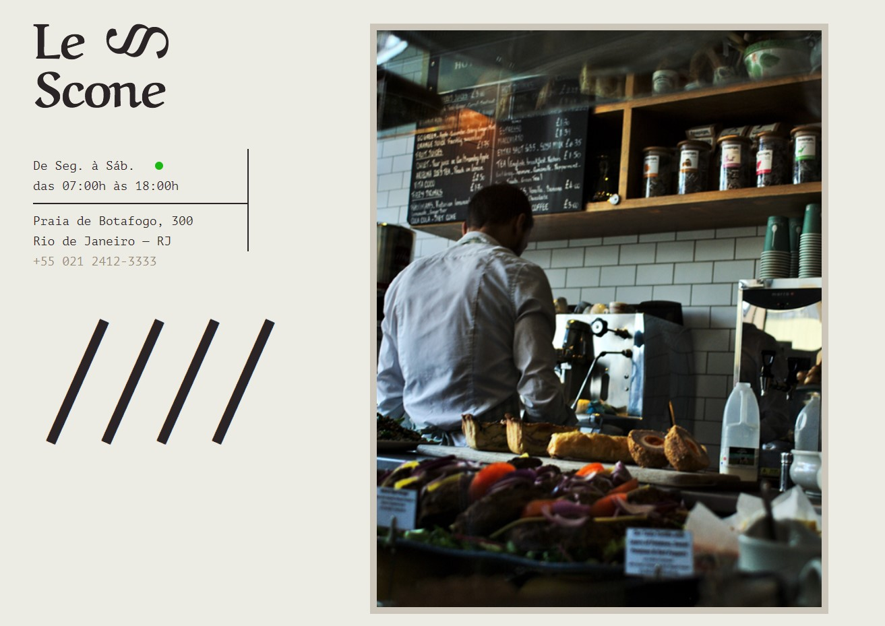

## 📦 Le Scone (a SASS Project)

This website was created as a task to complete the SASS course from [Origamid](https://www.origamid.com/curso/css-com-sass/).

The certificate of participation and completion of the course can be accessed [here](https://www.origamid.com/certificate/a9650538/).

🟣 - **The concepts covered in the course are:**

-   Import
-   Variables
-   Nesting
-   Mixins
-   Extend
-   Operators
-   Conditionals
-   Functions
-   Loops

🟢 - **The site can be acessed [here](http://bit.ly/le-scone).**

### Preview

