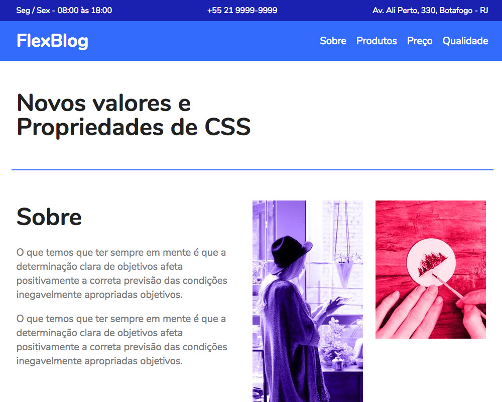

## 📦 Flexblog Project

This website was created as a task to complete the CSS Flexbox course from [Origamid](https://www.origamid.com/curso/css-flexbox/).

The certificate of participation and completion of the course can be accessed [here](https://www.origamid.com/certificate/cf4d5b74/).

🟣 - **The concepts covered in the course are:**

-   Display Flex
-   Flex-Direction
-   Flex-Wrap
-   Flex-Flow
-   Justify Content
-   Align-Items
-   Align-Content
-   Flex-Grow
-   Flex-Basis
-   Flex-Shrink
-   Flex (Flex-Grow, Flex-Basis and Flex-Shrink)
-   Order
-   Align-Self

🟢 - **The site can be acessed [here]().**

### Preview

